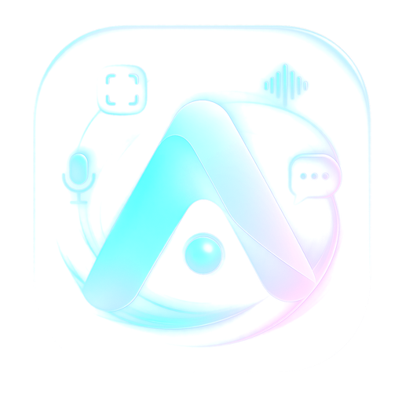

<p align="center">
  <picture>
    <source media="(prefers-color-scheme: dark)" srcset="assets/icons/png/icon_512x512.png">
    
  </picture>
</p>

<h1 align="center">
  <span style="background: linear-gradient(135deg, #38bdf8 0%, #818cf8 50%, #c084fc 100%); -webkit-background-clip: text; -webkit-text-fill-color: transparent;">XITKUN</span>
  <br/>
  <sup style="font-size: 0.35em; letter-spacing: 2px; color: #64748b;">DESKTOP AI COPILOT · LOCAL‑FIRST · PROVIDER AGNOSTIC</sup>
</h1>

<p align="center">
  
</p>

<br/>

<p align="center">
  <a href="https://github.com/Krekker0101/XITKUN/stargazers">
    
  </a>
  &nbsp;
  <a href="https://github.com/Krekker0101/XITKUN/releases">
    
  </a>
  &nbsp;
  <a href="LICENSE">
    
  </a>
  &nbsp;
  <a href="https://github.com/Krekker0101/XITKUN/commits/main">
    
  </a>
</p>

<p align="center">
  
  
  
  
  
  
</p>

<br/>

<p align="center" style="max-width: 800px; margin: 0 auto;">
  <strong style="font-size: 1.2em; color: #e2e8f0;">XITKUN</strong> 
  <span style="color: #94a3b8;">is a dark, local‑first AI desktop copilot built for the brutal reality of meetings, interviews, and coding under pressure. Screenshots, transcripts, instant answers — all without leaving your workflow.</span>
  <br/><br/>
  <span style="color: #38bdf8; font-weight: 500;">You bring the models. XITKUN brings the experience.</span>
</p>

<br/>

> [!IMPORTANT]
> **Complete provider freedom.** XITKUN doesn't lock you into any single AI vendor.
> ```text
> ✅ OpenAI / ChatGPT    ✅ OpenRouter    ✅ DeepSeek    ✅ Custom OpenAI‑compatible    ✅ Ollama (local)
> ```
> Your keys, your endpoints, your choice. Ollama models work **completely offline** — zero cloud dependency.

<br/>

---

## 🎯 THE XITKUN DIFFERENCE

<table align="center" style="border-collapse: collapse; width: 100%;">
  <tr>
    <td align="center" width="25%" style="padding: 20px 10px;">
      <div style="background: linear-gradient(135deg, #0f172a 0%, #1e293b 100%); border-radius: 16px; padding: 20px 10px; border: 1px solid #334155;">
        <span style="font-size: 36px;">🖥️</span><br/>
        <b style="color: #38bdf8; font-size: 1.1em;">Desktop‑First</b><br/>
        <sub style="color: #94a3b8;">Overlay workflow · zero tab‑switching · context stays local</sub>
      </div>
    </td>
    <td align="center" width="25%" style="padding: 20px 10px;">
      <div style="background: linear-gradient(135deg, #0f172a 0%, #1e293b 100%); border-radius: 16px; padding: 20px 10px; border: 1px solid #334155;">
        <span style="font-size: 36px;">🔓</span><br/>
        <b style="color: #818cf8; font-size: 1.1em;">Provider Freedom</b><br/>
        <sub style="color: #94a3b8;">OpenAI · OpenRouter · DeepSeek · custom — no lock‑in</sub>
      </div>
    </td>
    <td align="center" width="25%" style="padding: 20px 10px;">
      <div style="background: linear-gradient(135deg, #0f172a 0%, #1e293b 100%); border-radius: 16px; padding: 20px 10px; border: 1px solid #334155;">
        <span style="font-size: 36px;">📴</span><br/>
        <b style="color: #c084fc; font-size: 1.1em;">Offline‑Aware</b><br/>
        <sub style="color: #94a3b8;">Auto‑detects Ollama · works without internet · fully private</sub>
      </div>
    </td>
    <td align="center" width="25%" style="padding: 20px 10px;">
      <div style="background: linear-gradient(135deg, #0f172a 0%, #1e293b 100%); border-radius: 16px; padding: 20px 10px; border: 1px solid #334155;">
        <span style="font-size: 36px;">✨</span><br/>
        <b style="color: #34d399; font-size: 1.1em;">Product Polish</b><br/>
        <sub style="color: #94a3b8;">Cohesive branding · dark installer · no "demo‑ware" vibes</sub>
      </div>
    </td>
  </tr>
</table>

<br/>

<p align="center">
  
</p>

<br/>

---

## ⚡ CAPABILITY GRID

<table align="center" style="border-collapse: collapse; width: 100%;">
  <thead>
    <tr style="background: #0f172a;">
      <th style="padding: 16px; text-align: left; color: #38bdf8; font-size: 1.1em; border-bottom: 2px solid #38bdf8;">Domain</th>
      <th style="padding: 16px; text-align: left; color: #38bdf8; font-size: 1.1em; border-bottom: 2px solid #38bdf8;">What XITKUN Delivers</th>
    </tr>
  </thead>
  <tbody>
    <tr style="border-bottom: 1px solid #1e293b;">
      <td style="padding: 16px; color: #c084fc; font-weight: 600;">🧠 AI Services</td>
      <td style="padding: 16px; color: #cbd5e1;">Add your own ChatGPT / OpenAI, OpenRouter, DeepSeek, or any OpenAI‑compatible endpoint</td>
    </tr>
    <tr style="border-bottom: 1px solid #1e293b;">
      <td style="padding: 16px; color: #c084fc; font-weight: 600;">🦙 Ollama</td>
      <td style="padding: 16px; color: #cbd5e1;">Auto‑detects local models · offline‑capable · fully private execution</td>
    </tr>
    <tr style="border-bottom: 1px solid #1e293b;">
      <td style="padding: 16px; color: #c084fc; font-weight: 600;">🪟 Overlay UX</td>
      <td style="padding: 16px; color: #cbd5e1;">Fast, non‑intrusive assistance during live meetings, interviews, and deep work</td>
    </tr>
    <tr style="border-bottom: 1px solid #1e293b;">
      <td style="padding: 16px; color: #c084fc; font-weight: 600;">📸 Screenshot Workflows</td>
      <td style="padding: 16px; color: #cbd5e1;">Capture visual context · route directly into active model · instant analysis</td>
    </tr>
    <tr style="border-bottom: 1px solid #1e293b;">
      <td style="padding: 16px; color: #c084fc; font-weight: 600;">🎙️ Transcription + Context</td>
      <td style="padding: 16px; color: #cbd5e1;">Keep notes, transcripts, and workflow memory close to the desktop surface</td>
    </tr>
    <tr>
      <td style="padding: 16px; color: #c084fc; font-weight: 600;">📦 Shipping</td>
      <td style="padding: 16px; color: #cbd5e1;">Branded Windows installer · portable build · clean release artifacts</td>
    </tr>
  </tbody>
</table>

<br/>

---

## 🗺️ AI ROUTING MAP

<p align="center">
  
</p>

<br/>

<table align="center" style="border-collapse: collapse; width: 100%;">
  <thead>
    <tr style="background: #0f172a;">
      <th style="padding: 16px; text-align: left; color: #38bdf8; font-size: 1.1em;">Route</th>
      <th style="padding: 16px; text-align: center; color: #38bdf8; font-size: 1.1em;">Status</th>
      <th style="padding: 16px; text-align: left; color: #38bdf8; font-size: 1.1em;">Notes</th>
    </tr>
  </thead>
  <tbody>
    <tr style="border-bottom: 1px solid #1e293b;">
      <td style="padding: 16px; color: #e2e8f0;">ChatGPT / OpenAI</td>
      <td align="center" style="padding: 16px;"><span style="background: #059669; padding: 6px 16px; border-radius: 100px; color: white; font-weight: 600; font-size: 0.85em;">ACTIVE</span></td>
      <td style="padding: 16px; color: #94a3b8;">Official API with your key and chosen model</td>
    </tr>
    <tr style="border-bottom: 1px solid #1e293b;">
      <td style="padding: 16px; color: #e2e8f0;">OpenRouter</td>
      <td align="center" style="padding: 16px;"><span style="background: #059669; padding: 6px 16px; border-radius: 100px; color: white; font-weight: 600; font-size: 0.85em;">ACTIVE</span></td>
      <td style="padding: 16px; color: #94a3b8;">Multi‑model gateway via OpenAI‑compatible interface</td>
    </tr>
    <tr style="border-bottom: 1px solid #1e293b;">
      <td style="padding: 16px; color: #e2e8f0;">DeepSeek</td>
      <td align="center" style="padding: 16px;"><span style="background: #059669; padding: 6px 16px; border-radius: 100px; color: white; font-weight: 600; font-size: 0.85em;">ACTIVE</span></td>
      <td style="padding: 16px; color: #94a3b8;">DeepSeek models using OpenAI‑compatible endpoints</td>
    </tr>
    <tr style="border-bottom: 1px solid #1e293b;">
      <td style="padding: 16px; color: #e2e8f0;">Custom OpenAI‑compatible</td>
      <td align="center" style="padding: 16px;"><span style="background: #059669; padding: 6px 16px; border-radius: 100px; color: white; font-weight: 600; font-size: 0.85em;">ACTIVE</span></td>
      <td style="padding: 16px; color: #94a3b8;">Bring your own base_url, key, and model identifier</td>
    </tr>
    <tr>
      <td style="padding: 16px; color: #e2e8f0;">Ollama (Local)</td>
      <td align="center" style="padding: 16px;"><span style="background: #059669; padding: 6px 16px; border-radius: 100px; color: white; font-weight: 600; font-size: 0.85em;">ACTIVE</span></td>
      <td style="padding: 16px; color: #94a3b8;">Local detection · offline‑capable · fully private</td>
    </tr>
  </tbody>
</table>

<br/>

---

## 🏗️ ARCHITECTURE
┌─────────────────────────────────────────────────────────────────────┐  
│ RENDERER UI (React) │  
│ Overlay · Settings · Selectors · Flow │  
└─────────────────────────────────┬───────────────────────────────────┘  
│ Secure IPC  
┌─────────────────────────────────▼───────────────────────────────────┐  
│ ELECTRON MAIN PROCESS │  
│ Credential Storage · Desktop Integration │  
└───────────────┬───────────────────────────────┬─────────────────────┘  
│ │  
┌───────────▼───────────┐ ┌───────────▼───────────┐  
│ AI ROUTER LAYER │ │ LOCAL CONTEXT │  
│ Provider Abstraction │ │ Notes · Transcripts │  
└───────────┬───────────┘ │ Workflow Memory │  
│ └───────────────────────┘  
┌───────────┴───────────────────────────────┐  
│ │  
┌───▼───────────┐ ┌──────────────┐ ┌──────▼──────┐  
│ Ollama │ │ OpenRouter │ │ OpenAI │  
│ (Local Only) │ │ DeepSeek │ │ Custom │  
└───────────────┘ └──────────────┘ └─────────────┘

<br/>

---

## 📈 PROJECT PULSE

<p align="center">
  <a href="https://star-history.com/#Krekker0101/XITKUN&Date">
    <picture>
      <source media="(prefers-color-scheme: dark)" srcset="https://api.star-history.com/svg?repos=Krekker0101/XITKUN&type=Date&theme=dark" />
      
    </picture>
  </a>
</p>

<br/>

---
> 💡 **Pro tip:** Run `npm run dist` for multi‑platform builds (Windows + macOS + Linux)

  

---

## 🗺️ ROADMAP

<table align="center" style="border-collapse: collapse; width: 100%;"> <thead> <tr style="background: #0f172a;"> <th style="padding: 16px; text-align: left; color: #38bdf8;">Milestone</th> <th style="padding: 16px; text-align: center; color: #38bdf8;">Status</th> <th style="padding: 16px; text-align: left; color: #38bdf8;">Progress</th> </tr> </thead> <tbody> <tr style="border-bottom: 1px solid #1e293b;"> <td style="padding: 16px; color: #e2e8f0;">Core AI routing (OpenAI / Ollama / custom)</td> <td align="center" style="padding: 16px;"><span style="color: #34d399;">✅ Done</span></td> <td style="padding: 16px;"><span style="color: #34d399;">██████████</span> <span style="color: #64748b;">100%</span></td> </tr> <tr style="border-bottom: 1px solid #1e293b;"> <td style="padding: 16px; color: #e2e8f0;">Overlay UI & quick‑switch shortcuts</td> <td align="center" style="padding: 16px;"><span style="color: #34d399;">✅ Done</span></td> <td style="padding: 16px;"><span style="color: #34d399;">██████████</span> <span style="color: #64748b;">100%</span></td> </tr> <tr style="border-bottom: 1px solid #1e293b;"> <td style="padding: 16px; color: #e2e8f0;">Screenshot capture & context injection</td> <td align="center" style="padding: 16px;"><span style="color: #34d399;">✅ Done</span></td> <td style="padding: 16px;"><span style="color: #34d399;">██████████</span> <span style="color: #64748b;">100%</span></td> </tr> <tr style="border-bottom: 1px solid #1e293b;"> <td style="padding: 16px; color: #e2e8f0;">Windows installer branding</td> <td align="center" style="padding: 16px;"><span style="color: #34d399;">✅ Done</span></td> <td style="padding: 16px;"><span style="color: #34d399;">██████████</span> <span style="color: #64748b;">100%</span></td> </tr> <tr style="border-bottom: 1px solid #1e293b;"> <td style="padding: 16px; color: #e2e8f0;">macOS / Linux packaging</td> <td align="center" style="padding: 16px;"><span style="color: #fbbf24;">🚧 In Progress</span></td> <td style="padding: 16px;"><span style="color: #fbbf24;">██████░░░░</span> <span style="color: #64748b;">60%</span></td> </tr> <tr style="border-bottom: 1px solid #1e293b;"> <td style="padding: 16px; color: #e2e8f0;">Local transcript storage & search</td> <td align="center" style="padding: 16px;"><span style="color: #a78bfa;">🧪 Planned</span></td> <td style="padding: 16px;"><span style="color: #a78bfa;">██░░░░░░░░</span> <span style="color: #64748b;">20%</span></td> </tr> <tr style="border-bottom: 1px solid #1e293b;"> <td style="padding: 16px; color: #e2e8f0;">Multi‑provider fallback & load balancing</td> <td align="center" style="padding: 16px;"><span style="color: #a78bfa;">🧪 Planned</span></td> <td style="padding: 16px;"><span style="color: #a78bfa;">██░░░░░░░░</span> <span style="color: #64748b;">15%</span></td> </tr> <tr> <td style="padding: 16px; color: #e2e8f0;">Plugin system for custom tools</td> <td align="center" style="padding: 16px;"><span style="color: #64748b;">💡 Research</span></td> <td style="padding: 16px;"><span style="color: #64748b;">█░░░░░░░░░</span> <span style="color: #64748b;">5%</span></td> </tr> </tbody> </table>  

---

## 🧰 TECH STACK

<table align="center" style="border-collapse: collapse; width: 100%;"> <thead> <tr style="background: #0f172a;"> <th style="padding: 16px; text-align: left; color: #38bdf8; font-size: 1.1em;">Layer</th> <th style="padding: 16px; text-align: left; color: #38bdf8; font-size: 1.1em;">Technology</th> </tr> </thead> <tbody> <tr style="border-bottom: 1px solid #1e293b;"> <td style="padding: 16px; color: #c084fc;">Desktop Shell</td> <td style="padding: 16px; color: #cbd5e1;">Electron, Node.js</td> </tr> <tr style="border-bottom: 1px solid #1e293b;"> <td style="padding: 16px; color: #c084fc;">Frontend Framework</td> <td style="padding: 16px; color: #cbd5e1;">React 18, TypeScript, Vite</td> </tr> <tr style="border-bottom: 1px solid #1e293b;"> <td style="padding: 16px; color: #c084fc;">Styling</td> <td style="padding: 16px; color: #cbd5e1;">Tailwind CSS, CSS Modules</td> </tr> <tr style="border-bottom: 1px solid #1e293b;"> <td style="padding: 16px; color: #c084fc;">State & IPC</td> <td style="padding: 16px; color: #cbd5e1;">React Context, Electron IPC, Secure Preload</td> </tr> <tr style="border-bottom: 1px solid #1e293b;"> <td style="padding: 16px; color: #c084fc;">AI Runtime</td> <td style="padding: 16px; color: #cbd5e1;">OpenAI‑compatible APIs + Ollama local router</td> </tr> <tr style="border-bottom: 1px solid #1e293b;"> <td style="padding: 16px; color: #c084fc;">Native Modules</td> <td style="padding: 16px; color: #cbd5e1;">Rust (N‑API), native screen capture</td> </tr> <tr> <td style="padding: 16px; color: #c084fc;">Packaging</td> <td style="padding: 16px; color: #cbd5e1;">electron‑builder, NSIS for Windows</td> </tr> </tbody> </table>

## 🚀 QUICK START

```bash
# 1. Clone & enter
git clone https://github.com/Krekker0101/XITKUN.git && cd XITKUN

# 2. Install dependencies
npm install

# 3. Run in development mode
npm run app:dev

# 4. Build for production
npm run build && npm run build:electron

# 5. Package for Windows
npm run dist:win
```
## 📂 REPOSITORY STRUCTURE

```text

📁 src/                 → Renderer UI, settings, model switching, overlay surfaces
📁 electron/            → Main process, IPC, credential storage, desktop integrations
📁 native-module/       → Rust‑backed native features (screenshots, audio, etc.)
📁 assets/              → Icons, installer graphics, README visuals
📁 scripts/             → Build helpers, asset generation scripts
📁 release/             → Generated distributable artifacts
📄 package.json         → Dependencies and scripts
📄 LICENSE              → AGPL v3.0‑only
📄 README.md            → You are here
```


## 🤝 CONTRIBUTING

We welcome contributions, issues, and feature requests!

```bash

# Fork the repo
# Create your feature branch
git checkout -b feature/amazing-feature
# Commit your changes
git commit -m 'Add some amazing feature'
# Push to the branch
git push origin feature/amazing-feature
# Open a Pull Request
```
> 📋 See [GitHub Issues](https://github.com/Krekker0101/XITKUN/issues) for current tasks and ideas.

  

---

## 📜 LICENSE

```text

XITKUN — Desktop AI Copilot
Copyright (C) 2024–2025  Krekker0101 and contributors
This program is free software: you can redistribute it and/or modify
it under the terms of the GNU Affero General Public License as published
by the Free Software Foundation, version 3 only.
This program is distributed in the hope that it will be useful,
but WITHOUT ANY WARRANTY; without even the implied warranty of
MERCHANTABILITY or FITNESS FOR A PARTICULAR PURPOSE.  See the
GNU Affero General Public License for more details.
You should have received a copy of the GNU Affero General Public License
along with this program.  If not, see <https://www.gnu.org/licenses/>.
```
<p align="center"> <a href="LICENSE">  </a> </p>  

---

## 🔗 LINKS

<p align="center"> <a href="https://github.com/Krekker0101/XITKUN">  </a> &nbsp; <a href="https://github.com/Krekker0101/XITKUN/releases">  </a> &nbsp; <a href="https://tajik-develop.yzz.me">  </a> &nbsp; <a href="https://github.com/Krekker0101/XITKUN/issues">  </a> </p>  
<p align="center">  </p><p align="center"> <br/> <span style="color: #38bdf8;">━━━━━━━━━━━━━━━━━━━━━━━━━━━━━━━━━━━━━━━━━━━━━━━━━</span> <br/><br/> <sub style="color: #64748b; letter-spacing: 2px;"> BUILT WITH FOCUS · SHIPPED WITH CARE · FOR PEOPLE WHO LIVE ON THEIR DESKTOP </sub> <br/><br/> <span style="color: #38bdf8;">━━━━━━━━━━━━━━━━━━━━━━━━━━━━━━━━━━━━━━━━━━━━━━━━━</span> </p> ```


<br/>

---

## 👨‍💻 AUTHOR & MAINTAINER

<p align="center">
  <a href="https://tajik-develop.yzz.me">
    
  </a>
  &nbsp;&nbsp;
  <a href="https://github.com/Krekker0101">
    
  </a>
</p>

<br/>

<div align="center">
  <table style="border-collapse: collapse; background: linear-gradient(135deg, #0f172a 0%, #1e293b 100%); border-radius: 24px; padding: 30px 40px; border: 1px solid #334155; display: inline-block;">
    <tr>
      <td align="center" style="padding: 30px 50px;">
        <span style="font-size: 56px;">🧑‍💻</span>
        <br/>
        <span style="font-size: 2.2em; font-weight: 700; background: linear-gradient(135deg, #38bdf8 0%, #c084fc 100%); -webkit-background-clip: text; -webkit-text-fill-color: transparent;">Abdulloh Ashurov</span>
        <br/>
        <span style="color: #94a3b8; font-size: 1.2em; letter-spacing: 1px;">Creator & Lead Developer</span>
        <br/><br/>
        <span style="color: #e2e8f0;">Building tools that respect user freedom and desktop workflow.</span>
        <br/><br/>
        <a href="mailto:abdulloh@tajik.dev">
          
        </a>
      </td>
    </tr>
  </table>
</div>

<br/>

<p align="center">
  <span style="font-size: 2.8em; font-weight: 800; letter-spacing: 6px; background: linear-gradient(135deg, #38bdf8 0%, #818cf8 50%, #c084fc 100%); -webkit-background-clip: text; -webkit-text-fill-color: transparent;">Tajik.Dev</span>
  <br/>
  <span style="color: #64748b; font-size: 1em; letter-spacing: 3px;">— WHERE CODE MEETS CRAFT —</span>
</p>

<p align="center" style="max-width: 700px; margin: 0 auto; color: #94a3b8; font-size: 0.95em;">
  <strong>Tajik.Dev</strong> is an independent software studio crafting desktop‑native tools, 
  local‑first applications, and developer experiences that prioritize user control 
  over convenience. Founded and operated by Abdulloh Ashurov.
</p>

<br/>
